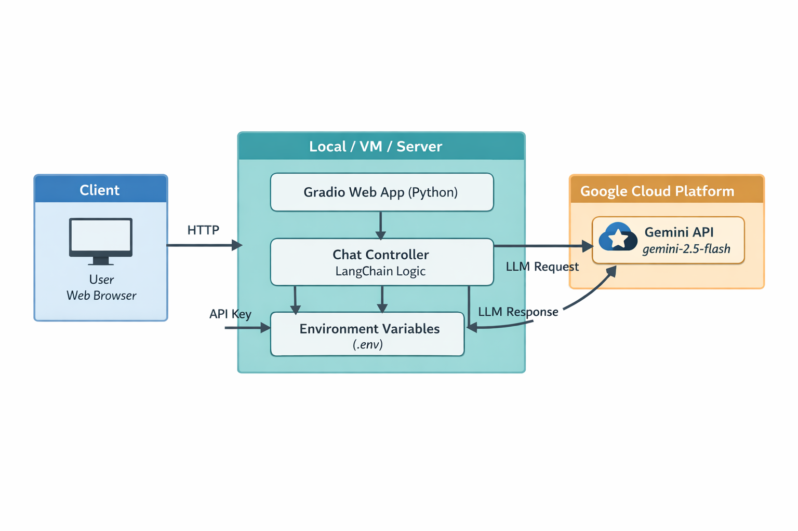

🧠 Multi-Persona Conversational Assistant

Powered by Gemini, LangChain & Gradio

A lightweight, extensible conversational AI assistant that supports multiple personas (Scientist, Analyst, Teacher) with a clean Gradio-based UI.
The assistant is powered by Google Gemini via LangChain, enabling structured prompts, conversation memory, and persona-driven responses.

✨ Features  
🔀 Multi-Persona Mode 
Switch between Scientist, Analyst, and Teacher personas 
Each persona uses a tailored system prompt to shape tone, depth, and reasoning

🧠 Context-Aware Conversations  
Maintains chat history using LangChain message objects  
Follow-up questions preserve conversational context  

🎛 Creativity Control  
Adjustable temperature slider to control response creativity

💬 Clean Chat Experience  
Messages stored as dictionaries with role and content  
Plain, professional conversational output

🖥 Modern UI with Gradio  
Responsive layout  
Persona selector and chat controls  
Ready for demos, internal tools, or further customization

🏗️ Architecture Overview  
Gradio UI  
    │  
   ▼  
Chat Function  
   │  
   ├── Persona System Prompt  
   ├── Conversation History  
   │  
   ▼  
LangChain Prompt Template  
   │  
   ▼  
Google Gemini (gemini-2.5-flash)

🛠️ Tech Stack  
Python 3.9+  
LangChain  
Google Gemini (Generative AI)  
Gradio  
python-dotenv

📂 Project Structure  
├── main.py        # Main application entry point  
├── .env                  # Environment variables (not committed)  
├── README.md             # Project documentation  
└── requirements.txt      # Python dependencies (recommended)      

⚙️ Installation & Setup
1️⃣ Clone the Repository
git clone https://github.com/your-username/multi-persona-ai-assistant.git
cd multi-persona-ai-assistant

2️⃣ Create & Activate Virtual Environment (Recommended)
python -m venv venv
source venv/bin/activate   # macOS / Linux
venv\Scripts\activate      # Windows

3️⃣ Install Dependencies
pip install -r requirements.txt

🔐 Environment Variables

Create a .env file in the project root:

GEMINI_API_KEY=your_google_gemini_api_key_here

⚠️ Never commit your .env file to GitHub.

▶️ Running the Application
python main.py

Once running, Gradio will launch a local web interface and optionally generate a public shareable link.

🧩 Personas Explained  
Scientist:	Hypothesis-driven, evidence-based, precise  
Analyst	Business-focused, structured, actionable  
Teacher	Step-by-step explanations, beginner-friendly  

Personas are implemented via system prompts, making it easy to add new ones.

🧠 Message Format

All chat messages are stored and passed internally as dictionaries:

{  
  "role": "user" | "assistant",  
  "content": "message text"  
}

This makes the system:  
UI-agnostic  
Easy to log, persist, or stream  
Compatible with LangChain memory patterns

🚀 Extensibility Ideas

✅ Add file upload (PDF / CSV / Docs)  
✅ Add conversation export (JSON / Markdown)  
✅ Plug in vector memory (FAISS / Chroma)  
✅ Role-based access (Admin vs User)  
✅ Deploy on Hugging Face Spaces or Cloud Run

📌 Use Cases  
-Internal AI assistants  
-Knowledge workers & analysts  
-Educational tools  
-AI demos & hackathons  
-Rapid prototyping of LLM interfaces

🤝 Contributing  
Contributions are welcome!
Feel free to fork the repo, create a feature branch, and submit a pull request.

📜 License  
This project is released under the MIT License.  
You are free to use, modify, and distribute it.

🙌 Acknowledgements  
Google Gemini  
LangChain  
Gradio

